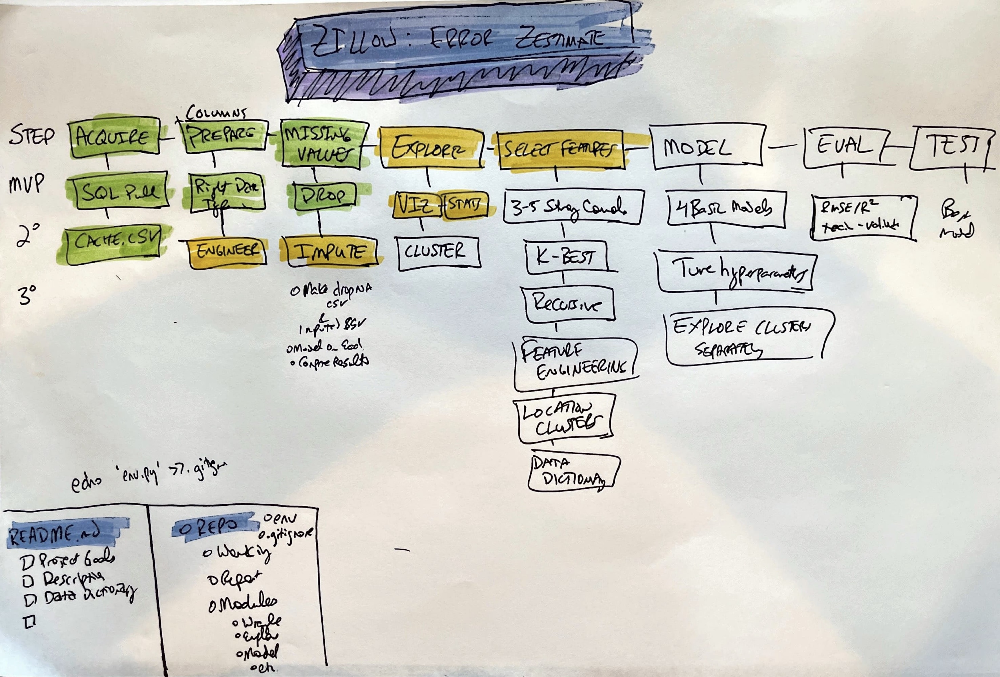

# classification-project
<<<<<<< HEAD
The repository contains the files for Jared Godar's Codeup project on clustering and modeling of zillo real estate data to predict error estimates
=======
The repsitory contains the files for Jared Godar's Codeup project on clustering and modeling of zillo real estate data to predict error estimates
>>>>>>> 6eacb1601455c50c68dc0df02c810ec0e0e3c7f7

---

## About the Project

### Project Goals

The main goal of this project is to be able to accurately predict the Zillow Zestimate error.

This will be accomplished by using past using property data from transactions of single family homes in 2017 and clustering of data to build at least four models, evaluating the effectiveness of each model, and testing the best model on new data is has never seen.

The ability to accurately value a home is essential for both buyers and sellers. The ability of us to predict error in zestimates will allow us to determine the major drivers of error then improve our estimates accordingly. Having the most accurate estimates possible is at the core of our business. 

### Project Description

This project provides the opportunity to create and evaluate multiple predictive models as well as implement other essential parts of the data science pipeline including data cleaning, imputing nulls, and clustering data to look for trends in subgroups.

It will involve pulling relevant data from a SQL database; cleaning that data; splitting the data into training, validation, and test sets; scaling data; feature engineering; exploratory data analysis; clustering; modeling; model evaluation; model testing; and effectively communicating findings in written and oral formats.

A home is often the most expensive purchase one makes in their lifetime. Having a good handle on pricing is essential for both buyers and sellers. An accurate pricing model factoring in the properties of similar homes will allow for appropriate prices to be set as well as the ability to identify under and overvalued homes. By determining drivers of error in our models, we can develop strategies to improve the models.

---

### Initial Questions

- What are the main drivers of estimate error?
- What are the relative importance of the assorted drivers?
- What factors reduce error?
- What factors don't matter?
- Are there any other potentially useful features that can be engineered from the current data available?
- Are the relationships suggested by initial visualizations statistically significant?
- Is the data balanced or unbalanced?
- Are there null values or missing data that must be addressed?
- Are there any duplicates in the dataset?
- Which model feature is most important for this data and business case?
- Which model evaluation metrics are most sensitive to this primary feature?

---

## Data Dictionary

|Target|Datatype|Definition|
|:-------|:--------|:----------|
| error | float64 | error in estimate (in dollars?)|
 
 
| variable  |     Dtype    | Definition |
|:----------|:-----------------------|:-----------|
|bedrooms    | float64 | Number of bedrooms |
|bathrooms   | float64 | Number of bathrooms |
|square_feet |  int64 | Area in square feet |
|year |  int64 | Year built |
|taxes       | float64 | Tax amount dollars |
|fips_number   |   int64 | Area code |
|zip_code      |   category | Zip Code |
|county_Orange      |   unit8 | Encoded county information |
|county_Ventura      |   unit8 | Encoded county information |
|county_avg (engineered) |  float64 | Average home price in county |
|baseline  (engineered) |  float64 | baseline |

 
 

---

### Steps to Reproduce

You will need your own env file with database credentials along with all the necessary files listed below to run my final project notebook. 
- [x] Read this README.md.
- [ ] Download the `acquire.py`, `prepare.py`, and `clustering_report.ipynb` files into your working directory.
- [ ] Add your own `env` file to your directory. (user, password, host).
- [ ] Run the `clustering_report.ipynb` workbook.

---

### The Plan

1. **Acquire, clean, prepare, and split the data:**
    - Pull from Zillo database.
    - Eliminate any unnecessary or redundant fields.
    - Engineer new, potentially informative features.
    - Search for null values and respond appropriately (delete, impute, etc.).
    - Deal with outliers.
    - Scale data appropriately.
    - Divide the data in to training, validation, and testing sets (~50-30-20 splits)
2. **Exploratory data analysis:**
    - Visualize pairwise relationships looking for correlation with home value.
    - Note any interesting correlations or other findings.
    - Test presumptive relationships for statistical significance.
    - Think of what features would be most useful for model.
    - Employ clustering to look for relationships between specific sub-groups.
    - Record any other interesting observations or findings.
    *NOTE: This data analysis will be limited to the training dataset*
3. **Model generation, assessment, and optimization:**
    - Establish baseline performance (mean model error, assuming error is normally distributed).
    - Generate a basic regression model using only strongest drivers.
    - Calculate evaluation metrics to assess quality of models (RMSE, R^2, and p as primary metrics).
    - Generate additional models incorporating other existing fields.
    - Use k-best and recursive feature selection to determine features.
    - Engineer additional features to use in other models.
    - Evaluate ensemble of better models on validation data to look for overfitting.
    - Select the highest performing model.
    - Test that model with the previously unused and unseen test data once and only once.
4. **Streamline presentation**
    - Take only the most relative information from the working along and create a succinct report that walks through the rationale, steps, code, and observations for the entire data science pipeline of acquiring, cleaning, preparing, modeling, evaluating, and testing our model.
    - Outline next steps for this project:
        - What can be done to improve this model?
        - What does this error model tell us about the estimate model?
        - How can these results inform 0

---

### Key Findings

- Most important factors 
- Factors that don't matter
- Model performance
- Improvement over baseline
- Counties
